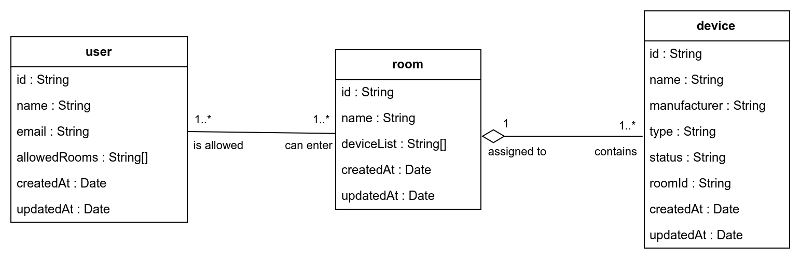

# DHBW_Portfolio_VertSysteme

Dieses Projekt wurde im Rahmen des Studiengangs Wirtschaftsinformatik an der DHBW Karlsruhe erstellt und dient als Portfolio zur Demonstration eines verteilten Systems. Es besteht aus zwei Microservices, die ein Smart-Home-System simulieren.

## Datenmodell

### ER-Diagram



### API Endpunkte

| Beschreibung          | URL-Pfad             | `GET` | `POST` | `PUT` | `PATCH` | `DELETE` |
| --------------------- | -------------------- | :---: | :----: | :---: | :-----: | :------: |
| Ressource "Gerät"     | `/api/v1/device/:id` |   x   |        |       |    x    |    x     |
| Collection "Gerät"    | `/api/v1/device/`    |   x   |   x    |       |         |          |
| Ressource "Zimmer"    | `/api/v1/room/:id`   |   x   |        |       |    x    |    x     |
| Collection "Zimmer"   | `/api/v1/room/`      |   x   |   x    |       |         |          |
| Ressource "Benutzer"  | `/api/v1/user/:id`   |   x   |        |       |    x    |    x     |
| Collection "Benutzer" | `/api/v1/user/`      |   x   |   x    |       |         |          |


## Anweisungen (KI-generiert)

### Voraussetzungen
- [Node.js](https://nodejs.org/) (18.x oder 20.x).
- [Docker](https://www.docker.com/) mit [Docker Compose](https://docs.docker.com/compose/).

### Einrichtung
1. **Repository klonen**:
   ```bash
   git clone https://github.com/manuelhier/DHBW_Portfolio_VertSysteme.git
   cd DHBW_Portfolio_VertSysteme
   ```
2. **Umgebungsvariablen**:
   Erstelle `.env`-Dateien in `smart-home-monitor` und `smart-home-controller`:
   ```
   MQTT_HOST=mqtt://localhost
   MQTT_USERNAME=<username>
   MQTT_PASSWORD=<password>
   ```
3. **Abhängigkeiten installieren**:
   ```bash
   cd smart-home-monitor && npm install
   cd ../smart-home-controller && npm install
   ```
4. **Datenbank starten**:
   ```bash
   cd smart-home-controller
   docker-compose up -d
   ```

### Starten der Microservices
- **Smart Home Monitor**:
  ```bash
  cd smart-home-monitor
  npm start # oder npm run dev
  ```
- **Smart Home Controller**:
  ```bash
  cd smart-home-controller
  npm start # oder npm run dev
  ```

### Testen
- **Swagger UI**: [http://localhost:8080/swagger](http://localhost:8080/swagger)
- **MQTT-Logs**: In der Konsole des `smart-home-monitor`.

## Technologien (KI-generiert)
- **Node.js**, **Express.js**, **Mongoose**, **MQTT**, **Swagger**, **Docker Compose**, **dotenv**, **nodemon**.

## Business Logik (KI-generiert)

### Room (Raum)
Ein Raum repräsentiert einen physischen Bereich im Smart-Home-System, wie z. B. ein Wohnzimmer oder eine Küche. Jeder Raum kann eine Liste von Geräten (`deviceList`) enthalten, die sich in diesem Raum befinden. Räume können auch in den `allowedRooms`-Listen von Benutzern referenziert werden, um anzugeben, welche Benutzer Zugriff auf den Raum haben.

#### Abhängigkeiten:
- **Devices**: Wenn ein Raum gelöscht wird, müssen alle Geräte, die diesem Raum zugeordnet sind, aktualisiert werden, sodass ihr `roomId` auf `null` gesetzt wird.
- **Users**: Wenn ein Raum gelöscht wird, muss er aus den `allowedRooms`-Listen aller Benutzer entfernt werden.

#### Operationen:
- **Löschen eines Raums**:
  - Alle Geräte in der `deviceList` des Raums werden aktualisiert, indem ihr `roomId` auf `null` gesetzt wird.
  - Der Raum wird aus den `allowedRooms`-Listen aller Benutzer entfernt, die Zugriff auf diesen Raum hatten.
  - Eine MQTT-Nachricht wird für jede dieser Änderungen veröffentlicht, um andere Systeme über die Aktualisierungen zu informieren.

### Device (Gerät)
Ein Gerät repräsentiert ein Smart-Home-Gerät, wie z. B. einen Lichtschalter oder ein Thermostat. Jedes Gerät kann einem Raum zugeordnet sein (`roomId`).

#### Abhängigkeiten:
- **Room**: Ein Gerät kann einem Raum zugeordnet sein. Wenn ein Raum gelöscht wird, wird das `roomId` des Geräts auf `null` gesetzt.
- **MQTT**: Änderungen an Geräten (z. B. Erstellen, Aktualisieren, Löschen) werden über MQTT-Nachrichten veröffentlicht.

#### Operationen:
- **Erstellen eines Geräts**:
  - Wenn ein `roomId` angegeben wird, wird das Gerät dem `deviceList` des entsprechenden Raums hinzugefügt.
- **Aktualisieren eines Geräts**:
  - Wenn das `roomId` geändert wird, wird das Gerät aus der `deviceList` des vorherigen Raums entfernt und der `deviceList` des neuen Raums hinzugefügt.
- **Löschen eines Geräts**:
  - Wenn das Gerät einem Raum zugeordnet ist, wird es aus der `deviceList` des Raums entfernt.

### User (Benutzer)
Ein Benutzer repräsentiert eine Person, die Zugriff auf bestimmte Räume im Smart-Home-System hat. Die Liste der zugänglichen Räume wird in der `allowedRooms`-Eigenschaft gespeichert.

#### Abhängigkeiten:
- **Room**: Ein Benutzer kann Zugriff auf mehrere Räume haben. Wenn ein Raum gelöscht wird, muss er aus der `allowedRooms`-Liste des Benutzers entfernt werden.
- **MQTT**: Änderungen an Benutzern (z. B. Erstellen, Aktualisieren, Löschen) werden über MQTT-Nachrichten veröffentlicht.

#### Operationen:
- **Erstellen eines Benutzers**:
  - Die angegebenen `allowedRooms` werden validiert, um sicherzustellen, dass die Räume existieren.
- **Aktualisieren eines Benutzers**:
  - Änderungen an der `allowedRooms`-Liste werden validiert, um sicherzustellen, dass keine ungültigen oder doppelten Räume hinzugefügt werden.
- **Löschen eines Benutzers**:
  - Der Benutzer wird aus der Datenbank entfernt, und eine MQTT-Nachricht wird veröffentlicht.

### Zusammenfassung der Abhängigkeiten
- **Room → Device**: Räume enthalten eine Liste von Geräten. Wenn ein Raum gelöscht wird, müssen die Geräte aktualisiert werden.
- **Room → User**: Räume können in den `allowedRooms`-Listen von Benutzern referenziert werden. Wenn ein Raum gelöscht wird, muss er aus diesen Listen entfernt werden.
- **Device → Room**: Geräte können einem Raum zugeordnet sein. Änderungen an Räumen beeinflussen die Geräte.
- **User → Room**: Benutzer haben Zugriff auf Räume. Änderungen an Räumen beeinflussen die Benutzer.

### Beispiel: Löschen eines Raums
1. Der Raum wird aus der Datenbank entfernt.
2. Alle Geräte in der `deviceList` des Raums werden aktualisiert:
   - Ihr `roomId` wird auf `null` gesetzt.
3. Der Raum wird aus den `allowedRooms`-Listen aller Benutzer entfernt.
4. Für jede dieser Änderungen wird eine MQTT-Nachricht veröffentlicht, um andere Systeme zu informieren.

Dieses Vorgehen stellt sicher, dass die Konsistenz zwischen den Entitäten gewahrt bleibt und alle Abhängigkeiten berücksichtigt werden.
